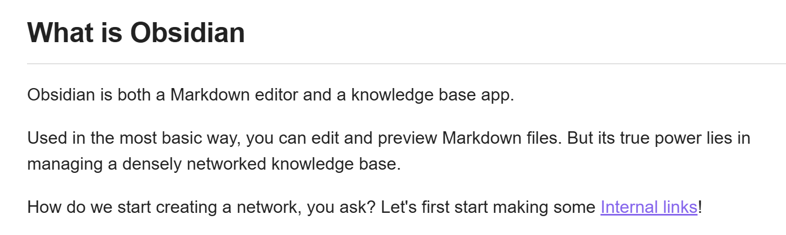
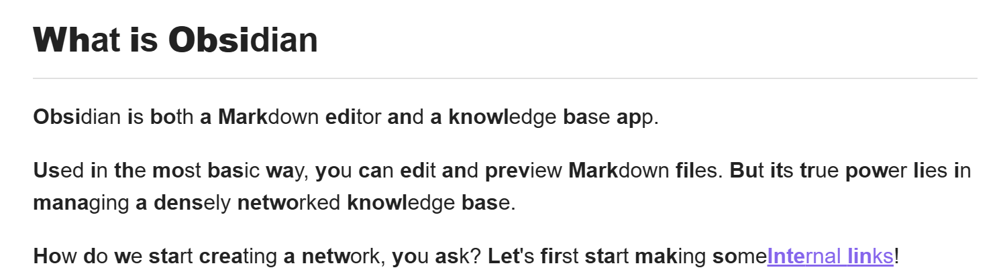
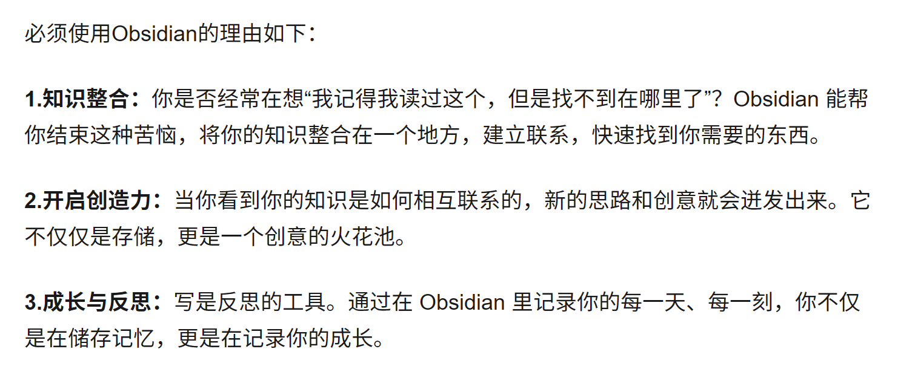
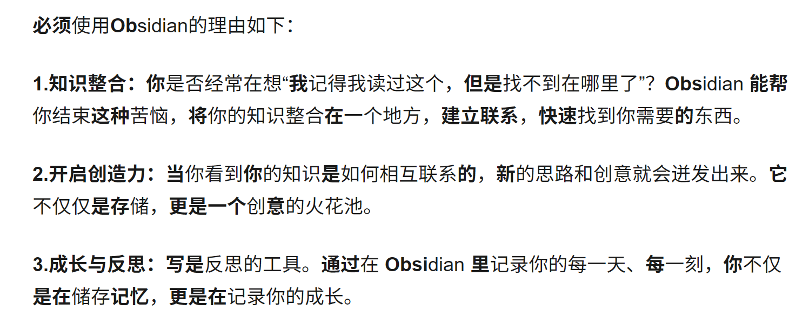

# Read! As! MyGoooooooo!

[English](#english) | [中文](#中文)

## English

This browser extension enhances the reading experience by selectively bolding words in both English and Chinese text. It uses a frequency-based approach for Chinese characters and a percentage-based approach for English words.

### Project Background

This browser extension was developed to enhance the reading experience by implementing principles of bionic reading and skimming techniques. The goal is to improve reading speed and comprehension for both English and Chinese text.

#### Bionic Reading

Bionic Reading is a method that aims to guide the eyes through text with artificial fixation points. This is achieved by bolding the first few letters of each word, which helps the brain complete the word more quickly. Our extension applies this concept to English text, allowing users to adjust the boldness percentage.

#### Skimming

Skimming is a reading technique used to identify the main ideas of a text quickly. It involves selectively bolding key words or phrases to draw the reader's attention. Our extension implements this for Chinese text by using word frequency data to identify and bold important words, making it easier for readers to grasp the main content quickly.

### Features

- Adjustable boldness levels for both English and Chinese text
- Customizable maximum number of bolded words per sentence in Chinese
- Uses word frequency data for intelligent Chinese text bolding
- Simple toggle on/off functionality
- For Chinese, users can customize word frequencies (common_words.json)

### Before and After

#### English Text
Before:

After:

#### Chinese Text
Before:

After:

### Installation

1. Download the extension files from the GitHub repository.
2. Open your Chrome browser and navigate to `chrome://extensions/`.
3. Enable "Developer mode" by toggling the switch in the top right corner.
4. Click on "Load unpacked" button that appears after enabling developer mode.
5. Select the folder containing the extension files you downloaded in step 1.
6. The extension should now appear in your list of installed extensions and be ready to use.

### Usage

1. Click on the extension icon in your browser toolbar to open the settings popup.
2. Adjust the boldness level, English boldness percentage, Chinese boldness probability, and maximum bold words per sentence as desired.
3. Click the "Toggle Reading Mode" button to activate the enhanced reading mode on the current page.
4. To deactivate, simply click the "Toggle Reading Mode" button again.

### Future Development

1. Implement NLP techniques to analyze sentence structure and main components.
2. Develop an engine to predict eye jump fixation positions, allowing readers to save time in finding the next eye jump location under the engine's guidance. Integrate human eye reading attention mechanisms and the saccade-fixation conversion process.

---

## 中文

通过选择性地加粗英文和中文文本中的单词来增强阅读体验。
在本项目中，对中文字符使用基于频率的方法,对英文单词使用基于百分比的方法。

### 项目背景

开发旨在通过实现仿生阅读和跳读技术的原理来增强阅读体验。
目标是提高英文和中文文本的阅读速度和理解能力。

#### 仿生阅读

仿生阅读是一种通过人工固定点引导眼睛阅读文本的方法。这是通过加粗每个单词的前几个字母来实现的,有助于大脑更快地完成单词的识别。
本项目将这个概念应用于英文文本,允许用户调整加粗的百分比。

#### 跳读

跳读是一种快速识别文本主要思想的阅读技巧。它通过选择性地加粗关键词或短语来吸引读者的注意力。
本项目通过使用词频数据来识别和加粗重要词语,从而为中文文本实现了这一技术,使读者能更容易快速把握主要内容。

### 功能

- 可调节的英文和中文文本加粗程度
- 可自定义中文每句话的最大加粗词数
- 使用词频数据进行智能中文文本加粗
- 简单的开启/关闭功能
- 对于中文，用户可以自定义词频（[common_words.json]）

### 使用前后对比

#### 英文文本
使用前:

使用后:

#### 中文文本
使用前:

使用后:

### 安装说明

1. 从GitHub仓库下载扩展文件。
2. 打开Chrome浏览器,导航至 `chrome://extensions/`。
3. 通过切换右上角的开关启用"开发者模式"。
4. 点击启用开发者模式后出现的"加载已解压的扩展程序"按钮。
5. 选择您在第1步中下载的包含扩展文件的文件夹。
6. 扩展程序现在应该出现在您的已安装扩展列表中,并准备就绪。

### 使用方法

1. 点击浏览器工具栏中的扩展图标,打开设置弹窗。
2. 根据需要调整加粗程度、英文加粗百分比、中文加粗概率和每句最大加粗词数。
3. 点击"切换阅读模式"按钮,在当前页面激活增强阅读模式。
4. 要停用,只需再次点击"切换阅读模式"按钮即可。

### 未来开发展望

1. 使用自然语言处理(NLP)技术分析句子结构和主要成分。
2. 开发引擎预判眼跳凝视位置,让读者在引擎的标注下节约寻找下一次眼跳位置的时间。整合人眼阅读注意力机制与扫视-凝视转换过程。
3. 加入对于数字的加粗选项（以及程度控制）
4. 适配更多平台（微信阅读等）
5. 默认开关

### 目前bug
1. 原本加粗的字体无法再次加粗（甚至会取消加粗）
2. 部分网站使用的时候会导致无法正常显示，具体表现为icon放大、排版失效等

